# 🌿 BROOMS AI: Премиальный нейроконсультант "Анастасия"

Автономный AI-менеджер по продажам для банного СПА-комплекса премиум-класса BROOMS (Санкт-Петербург). Агент спроектирован на платформе Nextbot и обучен продавать услуги через эмоции, ощущения и высокий уровень эмпатии.

## 💼 Бизнес-задача
* **Проблема:** Необходимость автоматизировать первую линию бронирований и грамотно презентовать премиальный отдых. В комплексе действует система унифицированных цен на услуги в различных вариантах пакетов (для разных компаний и форматов). Менеджерам приходилось тратить много времени на объяснение того, что входит в каждый пакет, и расчет итоговой стоимости.
* **Решение:** Внедрен AI-консультант "Анастасия", который берет на себя эмпатичную продажу, презентацию бань через эмоции (а не сухие списки) и автоматический подбор нужного пакета услуг под запрос клиента.

## 🏗 Архитектура решения

Схема работы агента и маршрутизации запросов (Function Calling):

```mermaid
%%{init: {"flowchart": {"curve": "step"}}}%%
flowchart TD
    %% Настройки стиля
    classDef ai fill:#6C5CE7,stroke:#fff,stroke-width:2px,color:#fff;
    classDef database fill:#00B894,stroke:#fff,stroke-width:2px,color:#fff;
    classDef api fill:#0984E3,stroke:#fff,stroke-width:2px,color:#fff;
    classDef client fill:#D63031,stroke:#fff,stroke-width:2px,color:#fff;

    USER(("Клиенты")):::client -->|"Запрос в мессенджере"| AGENT
    
    subgraph "Платформа Nextbot: AI Анастасия"
        AGENT(("AI Agent<br>Эмпатичный Промпт")):::ai
        
        %% Блок Function Calling
        AGENT -->|"Анализ запроса"| SWITCH{"Роутер функций"}
        
        SWITCH -->|"Детали услуг"| TOOL_DETAILS["Function: get_service_details"]:::api
        SWITCH -->|"Проверка дат"| TOOL_CALENDAR["Function: check_availability"]:::api
        SWITCH -->|"Сертификаты"| TOOL_CERT["Function: buy_certificate"]:::api
        SWITCH -->|"Бронирование"| TOOL_LEAD["Function: transfer_to_manager"]:::api
        
        TOOL_DETAILS <-->|"RAG поиск"| KB[("Справочник BROOMS")]:::database
    end
    
    %% Внешние системы
    TOOL_CALENDAR -.->|"Запрос слотов"| CALENDAR["Календарь бронирований"]:::database
    TOOL_LEAD -.->|"Отправка ФИО и дат"| CRM[("CRM / Менеджер")]:::database
    TOOL_CERT -.->|"Генерация ссылки"| ACQUIRING["Эквайринг"]:::api
    
    AGENT -->|"Ответ клиенту"| USER
```

🧠 Архитектура Промпта (System Logic)
Нейроконсультант работает по строгим правилам премиального клиентского сервиса:

1. Коммуникационная стратегия
Эмоциональные продажи: Описание услуг не через характеристики (метраж, температура), а через впечатления ("аромат алтайского кедра", "отдых на подогреваемом сеновале").

Микро-шаги: Короткие ответы (2-3 предложения), завершающиеся строго одним вовлекающим или уточняющим вопросом.

Отработка возражений: Мягкое признание права клиента на сомнение, переключение фокуса на ценность продукта (правило "запрет на прямолинейные скидки при первом отказе").

2. Воронка продаж (5 шагов)
Контакт: Приветствие, запрос имени и цели обращения.

Квалификация: Определение формата (девичник, романтика, перезагрузка) и состава гостей (пара, до 4 или до 8 человек).

Презентация: Подбор Малой или Большой бани под выявленную потребность.

Снятие страхов: Обоснование формата "всё включено" (халаты, косметика, тапочки).

Закрытие: Запрос удобных дат и передача данных живому менеджеру для фиксации брони.

⚙️ Система функций (Function Calling)
Для обеспечения 100% достоверности информации и автоматизации процессов агент использует вызов внешних инструментов:

[get_service_details] — Динамический запрос актуальной информации (описание, цены, составы СПА-программ) по Большой и Малой бане из Справочника.

[check_availability] — Проверка свободных слотов в календаре комплекса (по дате и типу бани) для мгновенного ответа клиенту.

[calculate_package_price] — Автоматический расчет стоимости отдыха с учетом выбранного пакета и точного количества гостей.

[buy_certificate] — Генерация индивидуальной ссылки на оплату подарочного сертификата без участия менеджера.

[transfer_to_manager] — Сбор подтвержденных данных (Имя, Телефон, Даты, Выбранная баня) и отправка сформированной карточки лида в CRM.

🛠 Технологический стек
AI Платформа: Nextbot

Логика: Prompt Engineering (Premium Tone of Voice), Function Calling

Данные: RAG на базе актуального Справочника услуг BROOMS

Интеграции: Внутренняя CRM, календарь бронирований, платежные системы.

Разработано архитектором AI-систем в рамках комплексной автоматизации клиентского сервиса.
