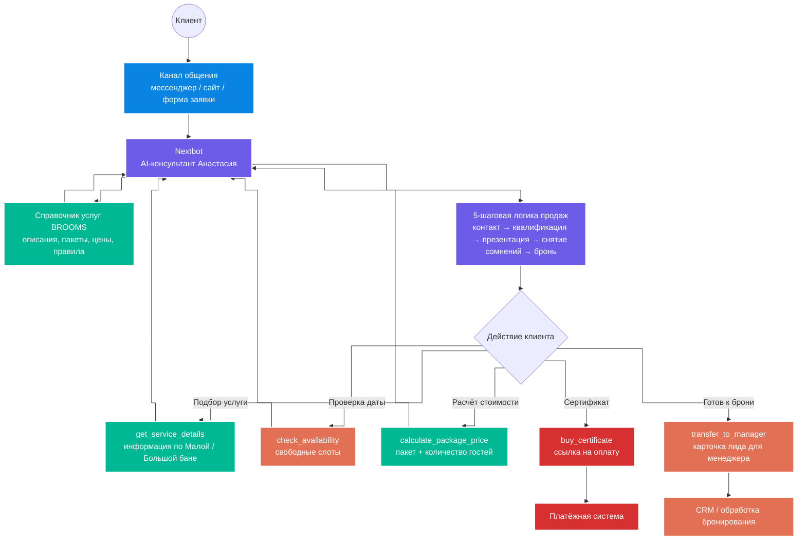

# 🌿 BROOMS AI: премиальный нейроконсультант для банного SPA-комплекса

**BROOMS AI** — это автономный AI-менеджер по продажам для банного SPA-комплекса премиум-класса **BROOMS** в Санкт-Петербурге.

Ассистент спроектирован на платформе **Nextbot** и выполняет роль первой линии продаж: консультирует гостей, помогает выбрать подходящий формат отдыха, презентует услуги через эмоции и ощущения, рассчитывает стоимость пакета и передаёт клиента менеджеру для бронирования.

AI-консультант обучен работать в премиальном Tone of Voice: мягко, эмпатично, с фокусом на ценность отдыха, атмосферу и заботу о госте.

---

## 🎥 Демонстрация работы

Можно протестировать работу AI-консультанта в Telegram:

👉 [@brooms_spb_bot](https://t.me/brooms_spb_bot)

⚠️ **Важно:** при тестировании обязательно напишите в первом сообщении: **“ТЕСТ ЗАЯВКА”**.  
Инструмент работает в реальном режиме, поэтому это нужно, чтобы команда BROOMS понимала, что обращение создано для проверки.

В демонстрации можно посмотреть полный путь клиента:

**первое сообщение → выявление формата отдыха → подбор Малой или Большой бани → расчёт стоимости → проверка даты → передача заявки менеджеру**

---

## 💼 Бизнес-проблема

BROOMS предлагает премиальный формат банного отдыха с разными вариантами пакетов, составом услуг и условиями для разных компаний гостей.

Из-за этого у клиентов часто возникают вопросы:

- чем отличается Малая баня от Большой;
- какой формат подойдёт для пары, девичника, романтического отдыха или компании друзей;
- что входит в пакет;
- сколько будет стоить отдых для конкретного количества гостей;
- какие даты свободны;
- можно ли купить подарочный сертификат;
- как забронировать удобное время.

Менеджерам приходилось тратить много времени на повторяющиеся консультации, объяснение пакетов, расчёт стоимости и сбор данных для бронирования.

При этом для премиального продукта важно не просто перечислить услуги, а правильно передать ощущение отдыха: атмосферу, заботу, приватность, эстетику и ценность формата.

---

## ✅ Что было реализовано

Разработан премиальный AI-консультант **“Анастасия”**, который берёт на себя первую линию консультаций и помогает клиенту прийти к бронированию.

Система умеет:

- консультировать гостей по услугам банного SPA-комплекса;
- подбирать формат отдыха под запрос клиента;
- определять состав гостей и повод визита;
- презентовать услуги через эмоции, атмосферу и ощущения;
- объяснять, что входит в пакет;
- рассчитывать стоимость отдыха под количество гостей;
- проверять доступность дат и слотов;
- помогать с покупкой подарочного сертификата;
- собирать данные клиента для бронирования;
- передавать готовую карточку лида менеджеру.

Главная ценность решения — AI-консультант не просто отвечает на вопросы, а ведёт клиента к бронированию через премиальную коммуникацию и персональный подбор услуги.

---

## 🏗 Архитектура

📈 Результат для бизнеса

После внедрения AI-консультанта BROOMS получает автоматизированную первую линию продаж для премиального клиентского сервиса.

Система позволяет:

снизить нагрузку на менеджеров;
быстрее отвечать клиентам на повторяющиеся вопросы;
грамотно презентовать премиальный отдых через ценность и эмоции;
помогать клиенту выбрать подходящий формат бани;
автоматически рассчитывать стоимость под конкретный состав гостей;
проверять доступность дат без ручного уточнения;
собирать структурированные данные для бронирования;
передавать менеджеру уже подготовленного клиента;
повысить качество коммуникации на первом касании;
увеличить конверсию из обращения в бронь.

🎯 Кому подходит решение

Решение подходит компаниям, где важно сочетать автоматизацию с высоким уровнем сервиса и персональной консультацией.

## 🎯 Кому подходит решение

Решение подходит компаниям, где важно сочетать автоматизацию с высоким уровнем сервиса и персональной консультацией.

Может использоваться в:

- банных SPA-комплексах;
- премиальных SPA и wellness-проектах;
- загородных клубах;
- отелях и базах отдыха;
- салонах красоты премиум-класса;
- фитнес- и wellness-клубах;
- event-площадках;
- компаниях с бронированием услуг;
- бизнесах, где нужно подбирать пакет под клиента;
- проектах, где важны атмосфера, эмоции и высокий уровень коммуникации.

---

## 🛠 Технологический стек

- **Nextbot** — AI-платформа для создания нейроконсультанта и логики диалога.
- **Prompt Engineering** — проектирование системного промпта, премиального Tone of Voice и правил поведения агента.
- **Function Calling** — вызов внутренних функций для подбора услуги, проверки дат, расчёта стоимости, покупки сертификата и передачи лида.
- **RAG** — поиск ответов по актуальному справочнику услуг BROOMS без выдумывания информации.
- **Справочник услуг BROOMS** — источник данных по баням, пакетам, ценам, составу услуг и правилам.
- **Календарь бронирований** — проверка свободных дат и слотов для записи клиента.
- **CRM** — передача карточки лида менеджеру для дальнейшей обработки.
- **Платёжные системы** — генерация ссылки на оплату подарочного сертификата.
- **Мессенджеры / сайт** — точки контакта клиента с AI-консультантом.

👨‍💼 Об авторе

Равиль Муртазин — автор проекта и специалист по AI-автоматизации бизнес-процессов.

Я помогаю бизнесу внедрять практические AI-решения: автоматизировать рутинные процессы, усиливать продажи, улучшать клиентский сервис и выстраивать управленческую аналитику.

В работе использую AI-модели, чат-ботов, CRM-интеграции, low-code/no-code платформы, автоматизированные воронки и инструменты для построения автономных бизнес-процессов.

Этот проект показывает, как AI-консультант может не просто отвечать на вопросы, а продавать премиальную услугу через правильную коммуникацию, эмоции, персональный подбор и доведение клиента до бронирования.

Основные направления работы
AI-автоматизация бизнес-процессов — внедрение решений, которые снимают рутину с сотрудников и ускоряют работу компании.
Чат-боты для продаж и клиентского сервиса — создание ботов, которые консультируют, квалифицируют и доводят клиента до заявки.
AI-консультанты на базе корпоративных знаний — ассистенты, которые отвечают клиентам по базе знаний компании без выдумывания информации.
AI-воронки и автоворонки — автоматизация пути клиента от первого обращения до заявки, записи или покупки.
Автоматизация отделов продаж — настройка процессов, которые помогают менеджерам быстрее обрабатывать лиды и не терять клиентов.
Интеграции с CRM и сервисами записи — передача заявок, статусов и данных клиентов в рабочие системы бизнеса.
Омниканальные боты для сайта и мессенджеров — запуск ассистентов в сайте-виджете, WhatsApp, Telegram, Instagram, ВКонтакте и MAX.
RAG-логика и Function Calling — подключение базы знаний и внутренних функций для точных ответов, записи, бронирования и передачи лидов.
AI-инструменты для руководителей и собственников бизнеса — решения для контроля, аналитики, качества сервиса и управляемости процессов.

📎 Статус проекта

Рабочий прототип премиального AI-консультанта для банного SPA-комплекса BROOMS на платформе Nextbot.

Решение может быть адаптировано под разные ниши, каналы коммуникации, базы знаний, CRM-системы, календари бронирования и сценарии продаж.
